##Power Point

[Deep Multi-Sensor Lane Detection.pptx](ppt/Deep Multi-Sensor Lane Detection.pptx)

[Lane detection.pptx](ppt/Lane_detection.pptx)

## Survey

[Lane Detection A Survey with New Results](papers/Lane_Detection_A_Survey_with_New_Results.pdf)

车道线检测是自动驾驶中的一个基础模块，其实也是一个由来已久的任务，早期已有很多基于传统图像处理实现的车道线检测算法。但随着大家研究的深入，车道线检测任务所应对的场景越来越多样化，逐步已经脱离了对于“白、黄色线条”这种低阶理解。目前更多的方式是寻求对于语义上车道线存在位置的检测，即使它是模糊的、被光照影响的、甚至是完全被遮挡的。

## Dataset

| Command | Description |
| --- | --- |
| git status | List all new or modified files |
| git diff | Show file differences that haven't been staged |

## Pixel Wise

自我车道检测主要是对当前车道及其边界进行检测，主要应用于在线，例如通过车道偏离检测让自动驾驶汽车保持在当前车道上。

[Efficient deep models for monocular road segmentation](papers/Efficient_deep_models_for_monocular_road_segmentation.pdf) IROS 2016 [code](https://github.com/k0suke-murakami/semantic_segmentation_for_lane_detection)

该方法针对路面检测和分割问题，如图1所示，结合FCN和U-Net提出一个网络Up-Convolutional Networks，在速度和精度方面得到不错的效果。
主要改进在一下几个方面：

1）Parameter reduction:  FCN在特征提取阶段使用了VGG16作为基础，这个网络有4096个 7\*7 大小的滤波器，这个大尺寸滤波器计算量比较大。 这里我们将  FC-conv 的滤波器数量从 4096 降低到 1024， 滤波器尺寸由 7\*7 变为 3\*3， 这样网络的参数减少一些，计算量也相应降低，当然精度有所下降，我们在网络的其他地方来提高精度。 
 
2) New refinement to improve system accuracy:  参考U-Net设计思想，增加了网络放大层的宽度。 

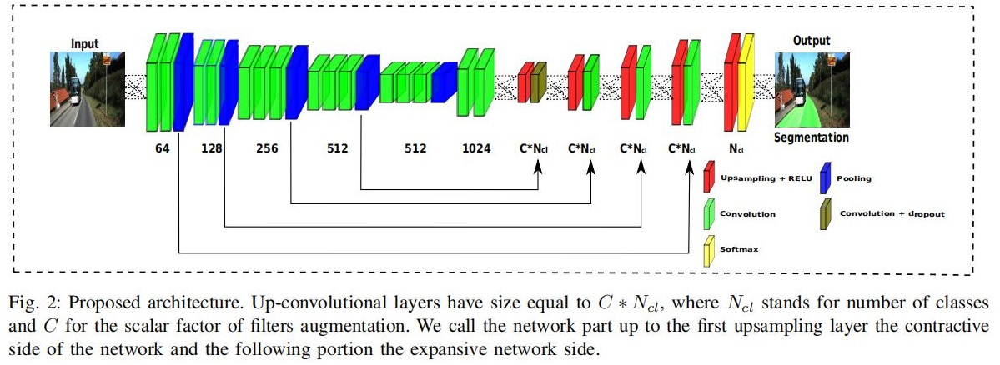

[RBNet A Deep Neural Network for Unified Road and Road Boundary Detection](papers/RBNet_A_Deep_Neural_Network_for_Unified_Road_and_Road_Boundary_Detection.pdf) NIPS 2017

RBNET(Road and road Boundary detection Network)在图像上准确检测道路及其边界是基于视觉的自动驾驶系统的一项基本任务。然而, 常用的方法要么只检测路，要么添加额外的处理阶段检测道路边界。该文章引入了深度神经网络，称为道路和道路边界检测网络(RBNet)，它可以在一个过程中同时检测道路和道路边界。首先研究道路之间的语境关系结构及其边界排列，然后通过实现贝叶斯模型，RBNet可以实现学习同时估计图像上像素的概率属于道路和道路的边界。

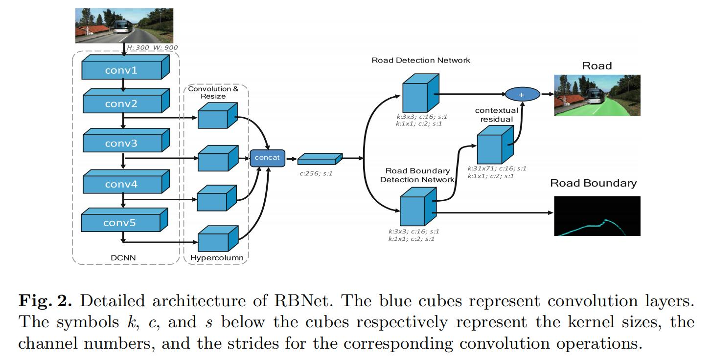

[MultiNet Real time Joint Semantic Reasoning for Autonomous Driving](papers/MultiNet_Real_time_Joint_Semantic_Reasoning_for_Autonomous_Driving.pdf) IEEE Intelligent Vehicles Symposium 2018 [code](https://github.com/MarvinTeichmann/MultiNet)

虽然大多数语义推理方法都专注于提高性能，但在本文中，我们认为计算时间对于实现自动驾驶等实时应用非常重要。为了达到这个目标，MultiNet提出了一种联合分类、检测和语义分割的方法，通过一个统一的架构，其中编码器在三个任务之间共享。可以进行端到端的训练，在具有挑战性的KITTI数据集中表现非常好，在道路分割任务中优于最先进的技术。MultiNet允许执行推断超过23帧每秒。

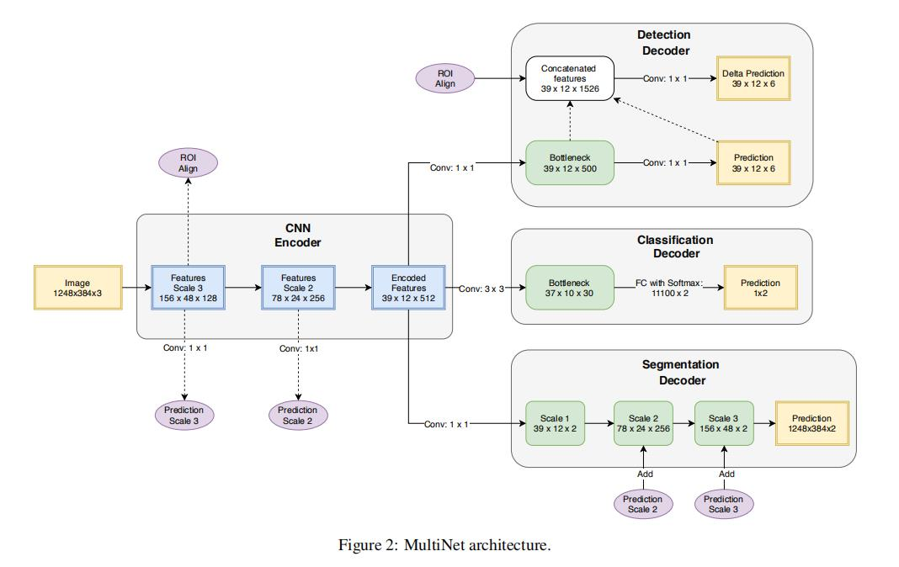

[Road segmentation using CNN and distributed LSTM](papers/Road_segmentation_using_CNN_and_distributed_LSTM.pdf) ISCAS 2019 [code1](https://github.com/Evvvvvvvva/AutonomousDriving) [coed2](https://github.com/ShirSherbet/Autonomous-Driving)

介绍了LSTM网络，并将其用于处理图像和特征图中的行和列。提出了一种新的网络结合卷积和分布式LSTM层来解决道路分割问题。在KITTI road基准测试中对网络进行了训练和测试。结果表明，与单纯的CNN结构相比，组合结构增强了特征提取和处理，但处理时间更短。在KITTI数据库上当年取得最好的成绩，现在是第三名。文章使用了distributed LSTM有效的提高了识别精度以及降低了运行参数量。

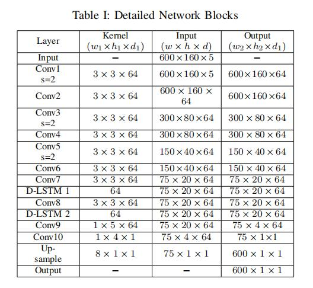

[VPGNet Vanishing point guided network for lane and road marking detection and recognition](papers/VPGNet_Vanishing_point_guided_network_for_lane_and_road_marking_detection_and_recognition.pdf) CVPR 2017 [code](https://github.com/SeokjuLee/VPGNet)

VPGNet建立了一个新的数据库Caltech Lanes，主要加入了一些恶劣天气下的图像样本，由于多雨和低光照的条件等天气条件下难度比较大，到目前为止还没有广泛的研究。例如，在雨天拍摄的图像会受到低照度的影响，而潮湿的道路会引起光线反射，扭曲车道和道路标记的外观。在夜间，在有限的光照下会发生颜色失真。因此，没有基准数据集存在，只有少数开发的算法可以在恶劣的天气条件下工作。为了解决这一缺点，VPGNet建立了一个车道和道路标记基准，该基准由约20000幅图像组成，包含17个车道和道路标记类别，适用于无雨、下雨、大雨和夜间四种不同的场景。训练和评估了多个版本的多任务网络，并验证了每个任务的重要性。由此产生的VPGNet方法，可以检测和分类车道和道路标记，并预测一个单前向通过消失点。实验结果表明，该方法在各种情况下都能获得较高的实时性(20 fps)和鲁棒性。

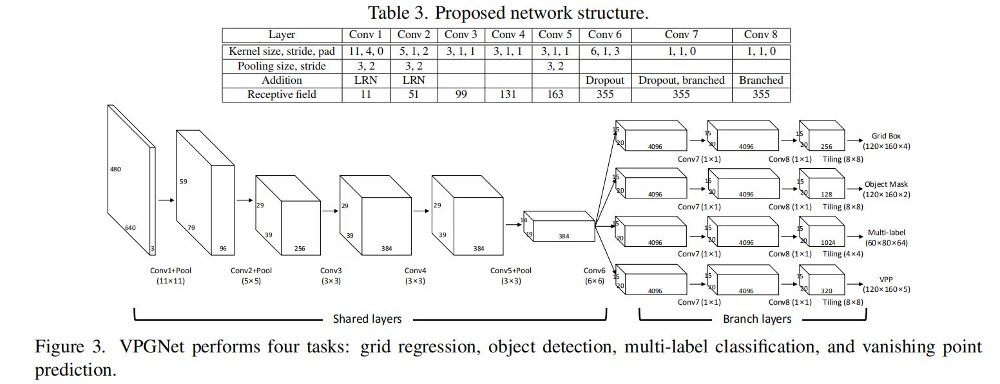

[Spatial as deep Spatial CNN for traffic scene understanding](papers/Spatial_as_deep_Spatial_CNN_for_traffic_scene_understanding.pdf) AAAI 2018 [code](https://github.com/XingangPan/SCNN)

尽管CNN在从原始像素中提取语义方面表现出了很强的能力，但现存CNN架构没有足够充分探索图像行和列上的空间关系能力。这些关系对于学习强先验形状的对象很重要，尤其是外观(图像像素)连贯性很弱。例如交通线，车道经常会被遮挡，或者压根就没在路上画车道线。Spatial CNN(CNN)将传统的卷积层接层layer-by-layer的连接形式的转为feature map中片连片卷积slice-by-slice的形式，使得图中像素行和列之间能够传递信息。这特别适用于检测长距离连续形状的目标或大型目标，有着极强的空间关系但是外观线索较差的目标，例如交通线，电线杆和墙。论文在车道检测挑战和CityScapes上评估了SCNN的表现，同时SCNN在TuSimple获得了第一名，准确率为96.53%

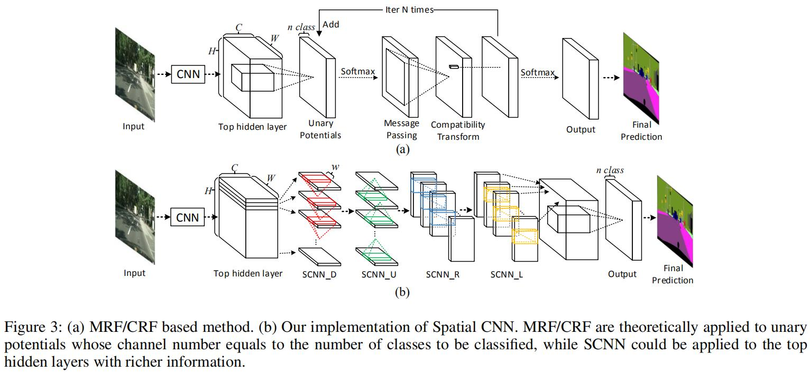

[Towards end-to-end lane detection An instance segmentation approach](papers/Towards_end-to-end_lane_detection_An_instance_segmentation_approach.pdf) Intelligent Vehicles Symposium 2018

现代汽车正在加入越来越多的驾驶员辅助功能，其中包括自动车道保持。后者允许汽车在道路车道内正确定位，这对于完全自动驾驶汽车后续的车道偏离或轨迹规划决策也至关重要。传统的车道检测方法依赖于高度专业化的、手工制作的特征和启发式的结合，通常随后是后处理技术，这是计算昂贵的，并且容易由于道路场景变化的可扩展性。最近的一些方法利用了深度学习模型，这些模型经过了像素分割训练，即使在图像中没有标记的情况下，因为它们的接受域很大。这些方法虽然有很多优点，但都局限于检测预先定义的固定数量的车道，如自我车道，不能应对变道。在本文中，我们超越了上述的限制，并提出将车道检测问题转换为实例分割问题——每个车道都形成自己的实例——可以端到端训练。为了在拟合车道之前对分割的车道实例进行参数化处理，我们进一步提出应用基于图像的学习视角变换，而不是固定的“鸟瞰图”变换。通过这样做，我们确保了车道拟合对道路平面的变化是健壮的，不像现有的方法依赖于固定的、预定义的转换。综上所述，我们提出了一种快速车道检测算法，运行速度为50fps，可以处理可变车道数和车道变化。我们在tuSimple数据集上验证了我们的方法，并取得了较好的结果。

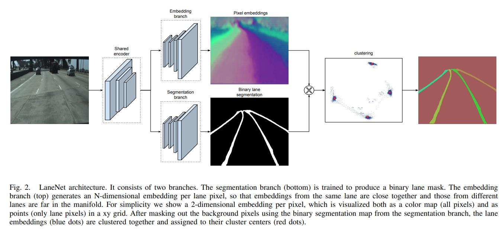

[Learning lightweight lane detection CNNs by self attention distillation](papers/Learning_lightweight_lane_detection_CNNs_by_self_attention_distillation.pdf) ICCV 2019 [code](https://github.com/cardwing/Codes-for-Lane-Detection)

训练车道检测的深度模型是具有挑战性的，因为车道标注中包含非常细微和稀疏的监督信号。由于没有从更丰富的背景中学习，这些模型常常在具有挑战性的场景中失败，例如严重的遮挡、模糊的车道和糟糕的光照条件。该文章提出了一种新的知识蒸馏方法，即自我注意蒸馏(SAD)，它允许模型从自身学习和获得实质性的改进，而不需要任何额外的监督或标签。具体地说，从一个训练到合理水平的模型中提取出的注意力地图会编码丰富的上下文信息。这些有价值的上下文信息可以被用作一种“自由”监督的形式，通过在网络本身内部执行自上而下和分层的注意力蒸馏来进一步进行表示法学习。SAD可以很容易地并入任何前馈卷积神经网络(CNN)中，并且不增加推理时间。我们使用诸如ENet、ResNet18和ResNet-34等轻量级模型，在三个流行的车道检测基准(TuSimple、CULane和BDD100K)上验证了SAD。最轻的模型，ENet-SAD，性能比较，甚至超过现有算法。值得注意的是，ENet-SAD比最先进的SCNN[16]少了20倍的参数，运行速度快了10倍，同时在所有基准测试中仍然实现了引人注目的性能。

[Multi-lane detection using instance segmentation and attentive voting](papers/Multi-lane_detection_using_instance_segmentation_and_attentive_voting.pdf) ICCAS 2019

自动驾驶正在成为领先的产业研究领域之一。因此，许多汽车公司都想出了半自动驾驶到完全自动驾驶的解决方案。在这些解决方案中，车道检测是关键的驾驶员辅助特性之一，在自动驾驶车辆的决策过程中起着至关重要的作用。人们提出了各种各样的解决方案来检测道路上的车道，包括使用手工制作的功能，以及最先进的端到端可培训的深度学习架构。这些架构中的大多数都是在交通受限的环境中训练的。在本文中，我们提出了一种新的解决方案多车道检测，它在精度和速度上都优于现有的方法。为了实现这一点，我们还提供了一个数据集与一个更直观的标签方案相比，其他基准数据集。在54.53 fps(平均)的情况下，我们可以获得99.87%的车道分割精度。

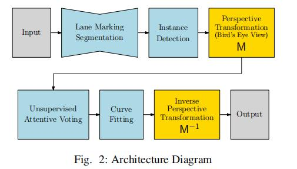

## 3D LaneNet And Anchor Based

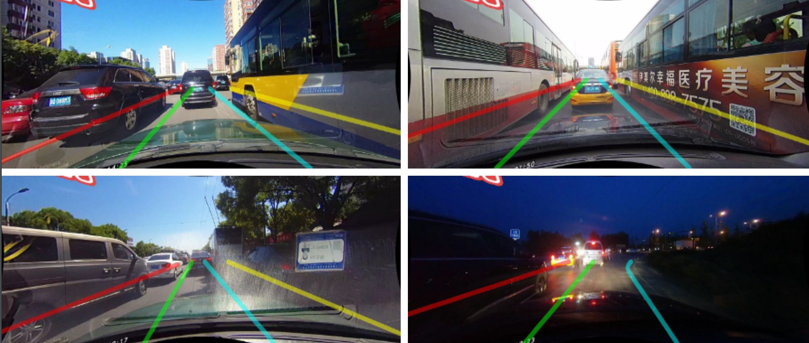

速度慢

	因为语义分割是逐像素分类的，要对图像中每一个像素点进行分类。
	为了分割车道线要进行非常密集的计算，导致的结果就是速度比较慢。
	另外车道线像素只占图像很少一部分，因此缺少针对性的语义分割效率比较低。

局部特征

	分割的另一个问题是感受野问题。因为语义分割基于全卷积得到分割结果，
	而卷积所体现的是局部特征，而单个像素的感受野有限。在车道线检测中这个问题影响比较大。
	语义线的检测需要对全局有很好的感知才能实现良好的定位。
	对于车道线的定位只有靠周围车流走向这种全局信息才能很好地定位。
	虽然有些很好的工作，比如SCNN使用不同方向上的特征传播实现信息传递，
	间接完成了增大感受野，增加全局信息的目标，但是速度更慢了。

[Deep multi-sensor lane detection](papers/Deep_multi-sensor_lane_detection.pdf) IROS 2018

可靠准确的车道检测一直是自动驾驶领域长期存在的问题。近年来，人们开发了许多使用图像(或视频)作为图像空间输入和推理的方法。在本文中，我们认为精确的图像估计不能转化为精确的三维车道边界，而这是现代运动规划算法所要求的输入。为了解决这个问题，我们提出了一种新的深度神经网络，它利用激光雷达和摄像机传感器，并直接在3D空间产生非常精确的估计。我们演示了我们的方法在高速公路和城市中的性能，并在复杂的情况下展示了非常精确的估计，比如交通拥挤(导致阻塞)、分叉、合并和交叉。

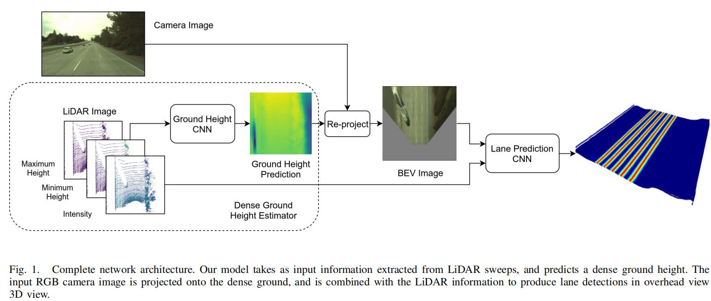

[3D-laneNet End-to-end 3D multiple lane detection](papers/3D-laneNet_End-to-end_3D_multiple_lane_detection.pdf) ICCV 2019
[code]()
引入了一种可以直接从单一图像预测道路场景中车道的三维布局的网络。这项工作标志着首次尝试用车载传感来解决这一任务，而无需假定已知的恒定车道宽度或依赖于预先映射的环境。我们的网络架构，3D-LaneNet，应用了两个新概念:内部网反透视映射(IPM)和基于锚点的通道表示。网络内IPM投影促进了常规图像视图和顶视图的双表示信息流。锚-列输出表示使我们的端到端方法取代了常见的启发式方法，如聚类和离群值拒绝，转换巷估计作为一个对象检测问题。此外可以显式地处理复杂的情况，如lane合并和分割。结果显示在两个新的三维车道数据集，一个合成和一个真实数据集。为了与现有的方法进行比较，我们在仅限图像的车道检测基准上测试了我们的方法，取得了与最新技术相媲美的性能。

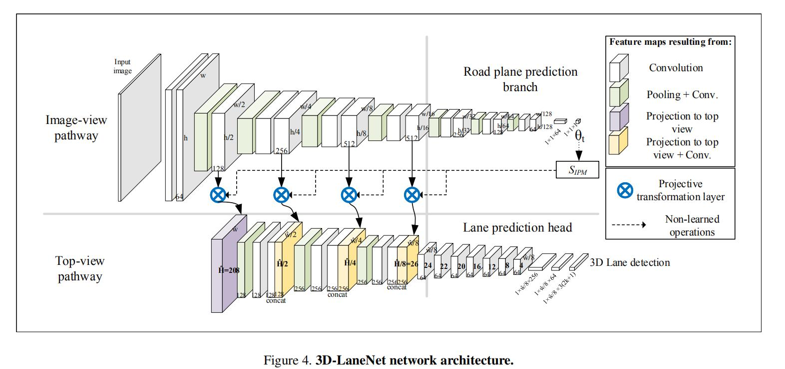

[Gen-LaneNet A Generalized and Scalable Approach for 3D Lane Detection](papers/Gen-LaneNet_A_Generalized_and_Scalable_Approach_for_3D_Lane_Detection.pdf) ECCV 2020
[code](https://github.com/yuliangguo/Pytorch_Generalized_3D_Lane_Detection) 
[Datasets](https://github.com/yuliangguo/3D_Lane_Synthetic_Dataset)

百度Apollo研究院2020年3月提出了一种广义和可扩展的方法，称为Gen-LaneNet，从单一图像检测三维车道。该方法灵感来自于最新的3D- lanenet，是在单一网络中解决图像编码、特征空间变换和三维车道预测的统一框架。提出了两种独特的设计Gen-LaneNet。首先在新的坐标系中引入了一种新的几何导向的车道锚点表示，并应用特定的几何变换直接从网络输出中计算出真实的三维车道点。证明了在处理不熟悉场景时，将车道点与新的坐标框架中基本的顶视图特征对齐是一种通用方法的关键。其次提出了一个可扩展的两阶段框架，将图像分割子网络的学习与几何编码子网络解耦。与3D-lanenet相比，Gen-LaneNet大大减少了在现实应用中实现健壮解决方案所需的3D-lane标签数量。此外还发布了一个新的合成数据集及其构建策略，以促进三维车道检测方法的发展和评价。在实验中进行了广泛的消融研究，证实了提出的Gen-LaneNet在平均精度(AP)和F-score方面显著优于3D-LaneNet。

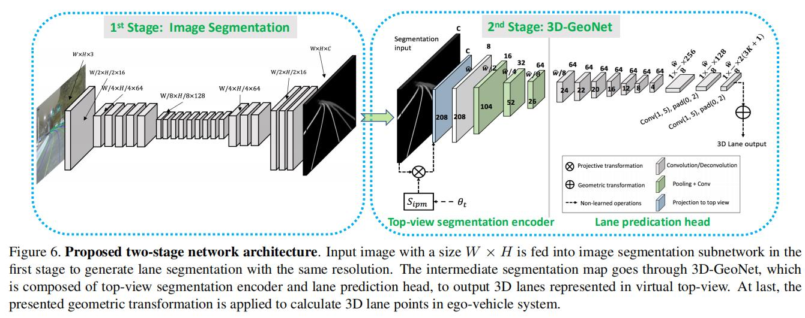

[Deep reinforcement learning based lane detection and localization](papers/Deep_reinforcement_learning_based_lane_detection_and_localization.pdf)

传统的深度学习算法只检测带有粗略边框的车道线，而忽略了特定曲线车道的形状。为了解决上述问题该文章将深度强化学习引入粗略车道检测模型中，以实现精确的车道检测和定位。该模型由边界盒探测器和地标点定位器两个阶段组成。具体而言,边界盒级卷积神经网络车道检测器以边界盒的形式输出车道的初始位置。。然后，基于增强的深度Q-Learning定位器(DQLL)将车道作为一组地标进行精确定位，以更好地表征曲线车道。构造并发布了一个像素级车道检测数据集NWPU车道数据集。它包含了各种真实的交通场景和精确的车道线遮罩，该方法在发布数据集和存储数据集上都取得了较好的性能。

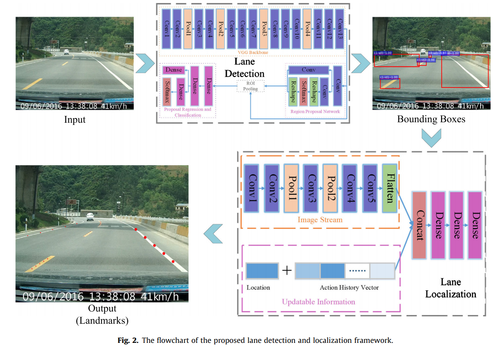

## 2020
[CurveLane-NAS: Unifying Lane-Sensitive Architecture Search and Adaptive Point Blending](papers/CurveLane_NAS_Unifying_Lane-Sensitive_Architecture_Search_and_Adaptive_Point_Blending.pdf)  ECCV 2020  [Datasets](https://github.com/xbjxh/curvelanes)

本文提出了CurveLane-NAS，一个NAS方法使得车道敏感架构搜索和自适应点混合统一的用于曲线车道检测，解决了曲线车道检测问题。新的框架可以自动融合和捕获长期相干和准确的曲线信息，并进行更有效的计算分配。与现有方法相比，搜索网络实现了速度/FLOPS权衡的SOTA。此外，我们还发布了一个名为CurveLanes的新的最大车道检测数据集，每幅图像拥有更多的曲线车道/车道，从而建立一个更具挑战性的基准。

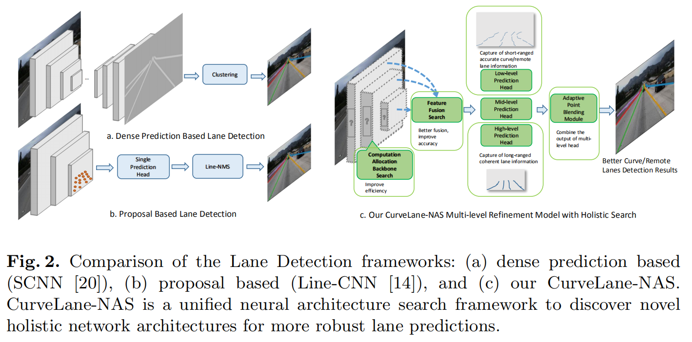

[Ultra Fast Structure-aware Deep Lane Detection](papers/Ultra_Fast_Structure_aware_Deep_Lane_Detection.pdf) ECCV 2020 [code](https://github.com/cfzd/Ultra-Fast-Lane-Detection)

现代方法主要作为车道检测pixel-wise分割的问题,努力解决这一问题的挑战性的场景和速度。受人感知的启发，在严重遮挡和极端光照条件下的车道识别主要基于上下文和全局信息。出于这一观点,我们提出一个新颖的,简单,但有效的制定目标以极快的速度和具有挑战性的场景。具体地说，我们将车道检测过程视为一个基于行的基于全局特征的选择问题。在基于行选择的情况下，该公式可以显著降低计算量。在全局特征上使用较大的接受域，我们也可以处理具有挑战性的场景。此外，在此基础上，我们还提出了一种结构损失来明确地模拟车道的结构。广泛的两车道检测基准数据集的实验表明,我们的方法可以实现先进的性能方面的速度和准确性。轻量级版本甚至可以达到每秒300+帧相同的决议,这是至少4倍的速度比之前的最先进的方法。

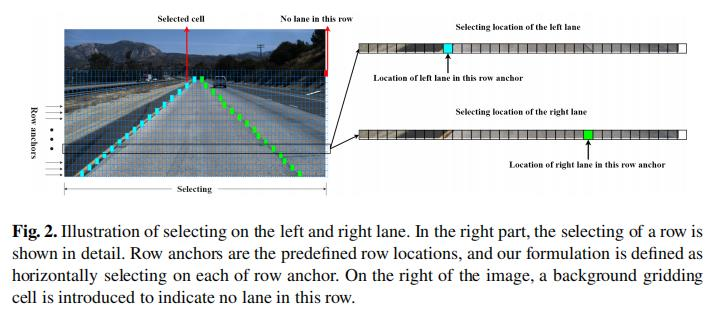
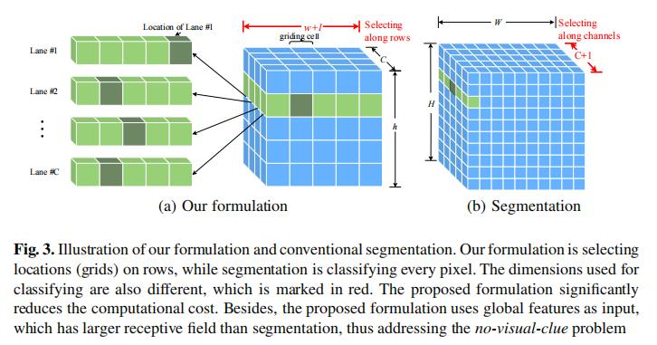

[Inter Region Affinity Distillation for Road Marking Segmentation](papers/Inter_Region_Affinity_Distillation_for_Road_Marking_Segmentation.pdf) CVPR 2020
[code](https://github.com/cardwing/Codes-for-IntRA-KD)

研究了将知识从一个大的深的教师网络提取到一个小得多的学生网络用于道路标记分割的问题。在这项工作中，我们探索了一种新的知识蒸馏(KD)方法，可以更有效地将场景结构上的“知识”从教师模型转移到学生模型。我们的方法被称为区域间亲和力(IntRA-KD)。它将给定的道路场景图像分解为不同的区域，并将每个区域表示为图中的一个节点。然后根据节点在特征分布上的相似性，建立节点之间的成对关系，形成区域间亲和力图。要从教师网络中学习结构知识，要求学生对教师生成的图形进行匹配。该方法以各类轻量化模型为学生，以ResNet-101为教师，在ApolloScape、CULane和LLAMAS三种大型道路标记分割基准上取得了良好的分割效果。与以前的蒸馏方法相比，IntRA-KD在所有的轻量级模型上都能带来更高的性能收益。

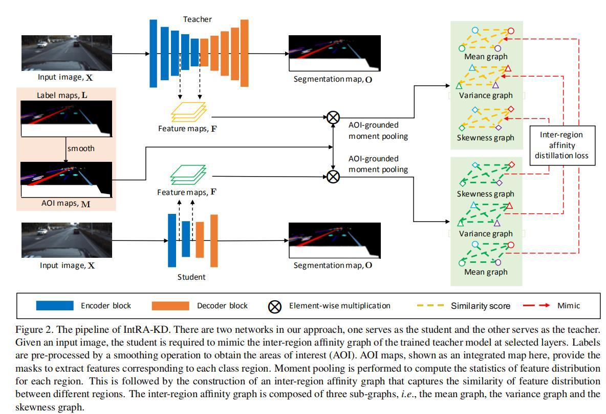

[FusionLane Multi-Sensor Fusion for Lane Marking Semantic Segmentation Using Deep Neural Networks](papers/FusionLane_Multi-Sensor_Fusion_for_Lane_Marking_Semantic_Segmentation_Using_Deep_Neural_Networks.pdf) 
[code](https://github.com/rolandying/FusionLane)

来源于DeepAI的2020年文章，实现车道标记的有效语义分割是构建车道级高精度地图的关键步骤。近年来，人们提出了多种图像语义分割方法。这些方法主要针对相机的图像，由于传感器自身的限制，无法获得车道标刻的准确三维空间位置，无法满足车道级高精度地图构建的需求。提出了一种基于激光雷达和摄像机融合深度神经网络的车道标记语义分割方法。与其他方法不同，为了获得分割结果的准确位置信息，本文的语义分割对象是由激光雷达点云转换而来的鸟瞰图，而不是相机捕获的图像。这个方法首先使用deeplabV3+网络对相机捕获的图像进行分割，分割结果与激光雷达采集的点云合并，作为网络的输入。在该神经网络中，我们还添加了长短期记忆(LSTM)结构，以帮助网络利用时间序列信息对车道标记进行语义分割。在14000多个人工标记和扩展的图像数据集上的实验表明，该方法在云鸟瞰图点的语义分割上有较好的效果。从而大大提高了高精度地图构建的自动化程度。

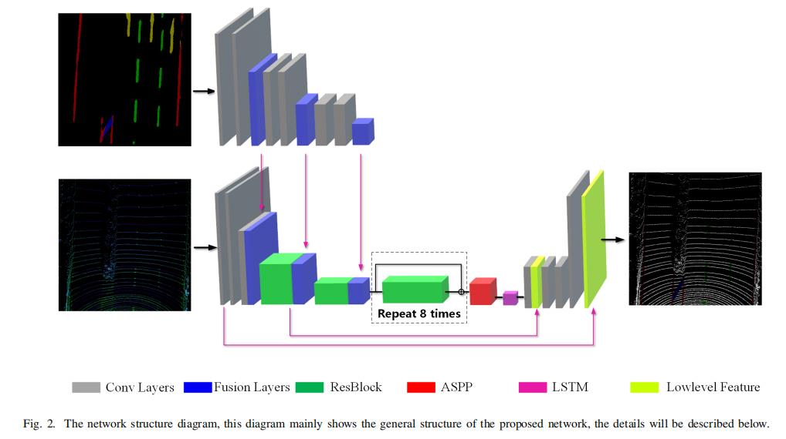

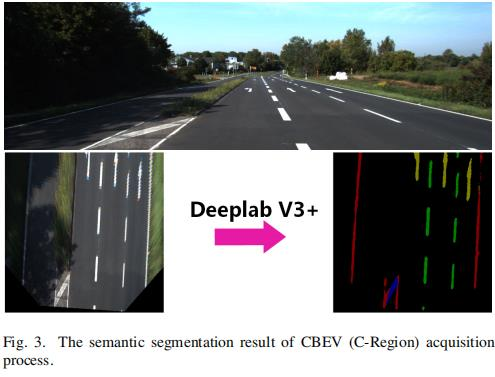

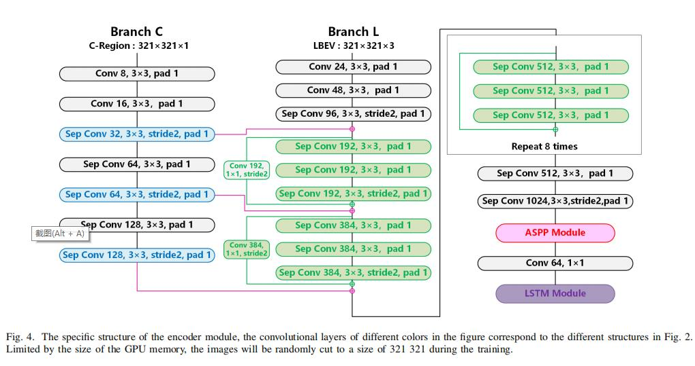

## Others
[FastDraw Addressing the long tail of lane detection by adapting a sequential prediction network](papers/FastDraw_Addressing_the_long_tail_of_lane_detection_by_adapting_a_sequential_prediction_network.pdf) 
  
[Drivable road detection based on dilated FPN with feature aggregation](papers/Drivable_road_detection_based_on_dilated_FPN_with_feature_aggregation.pdf) 

[Heatmap based Vanishing Point boosts Lane Detection](papers/Heatmap_based_Vanishing_Point_boosts_Lane_Detection.pdf)

[Inter Region Affinity Distillation for Road Marking Segmentation](papers/Inter_Region_Affinity_Distillation_for_Road_Marking_Segmentation.pdf)

[Lane detection and classification using cascaded CNNs](papers/Lane_detection_and_classification_using_cascaded_CNNs.pdf)

[Lane Detection A Survey with New Results](papers/Lane_Detection_A_Survey_with_New_Results.pdf)

[Lane Detection For Prototype Autonomous Vehicle](papers/Lane_Detection_For_Prototype_Autonomous_Vehicle.pdf)

[Lane Detection Model Based on Spatio Temporal Network with Double ConvGRUs](papers/Lane_Detection_Model_Based_on_Spatio_Temporal_Network_with_Double_ConvGRUs.pdf)

[PolyLaneNet Lane Estimation via Deep Polynomial Regression](papers/PolyLaneNet_Lane_Estimation_via_Deep_Polynomial_Regression.pdf)

[SpinNet Spinning convolutional network for lane boundary detection](papers/SpinNet_Spinning_convolutional_network_for_lane_boundary_detection.pdf)
Computational Visual Media 2019.12

提出了一个简单而有效的车道边界检测框架SpinNet，考虑到车辆或行人经常遮挡车道边界，车道边界局部特征不明显，分析和收集全局上下文信息对车道边界检测至关重要。为此，SpinNet在网络中设计了一个新的自旋卷积层和一个全新的车道参数化分支，从全局的角度检测车道边界。提取strip-shaped狭窄领域的特性,采用1×n、n×1形状旋转的卷积层。为了解决直条状卷积只能提取垂直或水平方向的特征的问题，引入了feature map旋转的概念，使得卷积可以在多个方向上应用，从而可以收集到更多关于整个车道边界的信息。此外，与大多数现有的从分割掩模中提取车道边界的车道边界检测器不同，我们的车道边界参数化分支预测了输出特征图中每个像素的车道边界曲线表达式。网络利用这些信息来预测曲线的权重，从而更好地形成最终的车道边界，并且可以进行端到端训练。

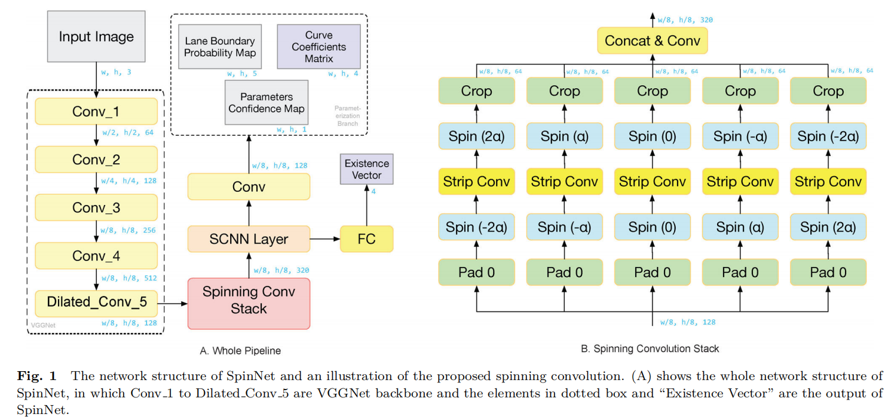

[Synthetic to Real Domain Adaptation for Lane Detection](papers/Synthetic_to_Real_Domain_Adaptation_for_Lane_Detection.pdf)

[Ultra Fast Structure aware Deep Lane Detection](papers/Ultra_Fast_Structure_aware_Deep_Lane_Detection.pdf)

